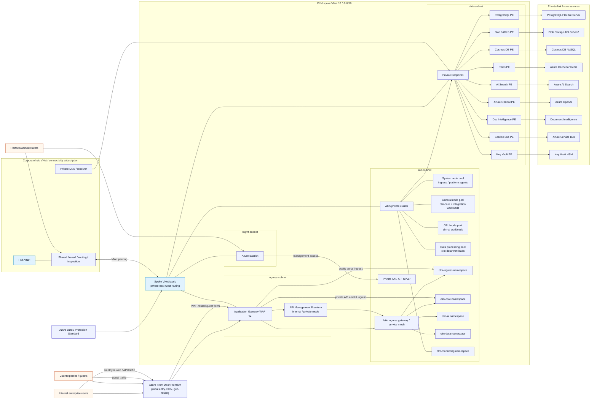

# Enterprise CLM on Azure - Architecture Diagrams

This document describes a production-grade enterprise Contract Lifecycle Management (CLM) platform deployed on Azure. The platform spans six repositories, approximately 40 AKS-hosted workloads, Azure-native data and messaging services, AI/ML services, and external enterprise integrations.

## Subscription and resource group strategy rationale

The subscription split follows Azure Landing Zone principles commonly used in Microsoft internal estates: **production**, **non-production**, and **connectivity** are isolated so policy assignment, RBAC/PIM, budget control, incident containment, and change approval can be managed independently. This reduces blast radius, keeps lower-trust dev/test activity outside the production boundary, and cleanly separates shared networking from workload ownership.

Within `sub-clm-prod`, resource groups are aligned to control domains: compute, data, cache, AI, security, networking, messaging, monitoring, integration, and analytics. That layout supports Microsoft internal compliance expectations by enabling targeted Azure Policy scopes, private-link-only access to regulated data services, dedicated security boundaries for Key Vault HSM and managed identities, centralized monitoring and audit evidence, and clean separation of duties between platform, security, networking, and application teams. The non-production subscription mirrors the same pattern for deployment parity without weakening production isolation.

> **Service mesh note:** Istio v1.20 is assumed to run in **STRICT mTLS** mode across AKS, so east-west pod traffic is encrypted, authenticated, and policy-controlled between all pods.

## 1. Service Architecture Diagram

**Diagram note:** dashed lines represent ubiquitous shared dependencies on Redis and PostgreSQL.

```mermaid
flowchart TB
    classDef core fill:#dbeafe,stroke:#1d4ed8,color:#0f172a;
    classDef data fill:#dcfce7,stroke:#15803d,color:#0f172a;
    classDef ai fill:#f3e8ff,stroke:#7e22ce,color:#0f172a;
    classDef integ fill:#fef3c7,stroke:#b45309,color:#0f172a;
    classDef portal fill:#fee2e2,stroke:#dc2626,color:#0f172a;
    classDef platform fill:#e5e7eb,stroke:#374151,color:#0f172a;
    classDef external fill:#fff7ed,stroke:#9a3412,color:#0f172a;

    Users["Enterprise users"]
    Guests["Counterparties / guest users"]
    Apps["Internal apps / partner systems"]

    subgraph Portal["claim-clm-portal / clm-ingress namespace"]
        CounterpartyPortal["clm-counterparty-portal<br/>Next.js portal"]
        GuestAuth["clm-guest-auth-service<br/>external / guest auth"]
    end

    subgraph Core["claim-clm / clm-core namespace"]
        Web["clm-web<br/>React SPA"]
        API["clm-api<br/>REST API"]
        Template["clm-template-service<br/>template engine"]
        Workflow["clm-workflow-engine<br/>Temporal / Durable orchestrations"]
        SLA["clm-sla-enforcer<br/>CronJob every 5 minutes"]
        Notify["clm-notification-worker<br/>email / SMS worker"]
        Realtime["clm-realtime-hub<br/>SignalR hub"]
        Webhook["clm-webhook-dispatcher<br/>outbound webhooks"]
        Audit["clm-audit-writer<br/>audit persistence"]
        SearchSvc["clm-search-service<br/>search API / indexing facade"]
    end

    subgraph StorageRepo["claim-clm-storage / clm-data namespace"]
        StorageAPI["clm-storage-api<br/>document storage / retrieval"]
        Indexer["clm-doc-indexer<br/>indexing pipeline worker"]
        Extractor["clm-doc-extractor<br/>OCR / extraction worker"]
        Preview["clm-doc-preview<br/>preview / conversion service"]
        Classifier["clm-doc-classifier<br/>classification worker"]
    end

    subgraph AIRepo["claim-clm-ai / clm-ai namespace"]
        AISum["clm-ai-summarizer"]
        AIExtract["clm-ai-extractor"]
        AIRisk["clm-ai-risk-scorer"]
        AIDev["clm-ai-deviation"]
        AIDraft["clm-ai-drafter"]
        AIPII["clm-ai-pii"]
        AISemSearch["clm-ai-search"]
        AITrans["clm-ai-translator"]
        AISent["clm-ai-sentiment"]
        AIPred["clm-ai-prediction"]
        AIChat["clm-ai-chatbot"]
        AIDigest["clm-ai-digest"]
    end

    subgraph Integration["claim-clm-integration / integration services"]
        ESign["clm-esign-adapter"]
        SalesforceConn["clm-salesforce-connector"]
        SAPConn["clm-sap-connector"]
        TeamsBot["clm-teams-bot"]
        M365Addin["clm-m365-addin"]
        PowerAutomate["clm-power-automate"]
        GraphQL["clm-graphql-api"]
    end

    subgraph SharedAzure["Shared Azure services"]
        Bus["Azure Service Bus Premium"]
        Redis["Azure Cache for Redis Premium"]
        Postgres["Azure Database for PostgreSQL Flexible Server"]
        Blob["Azure Blob Storage ADLS Gen2"]
        Cosmos["Azure Cosmos DB NoSQL"]
        AISearch["Azure AI Search Standard S2"]
        OpenAI["Azure OpenAI Service"]
        DocIntel["Azure AI Document Intelligence v4.0"]
        LangAI["Azure AI Language"]
        TranslatorAI["Azure AI Translator S2"]
        AML["Azure Machine Learning"]
        CommSvc["Azure Communication Services"]
        SignalR["Azure SignalR Service Premium"]
        Entra["Microsoft Entra ID / External ID"]
    end

    subgraph ExternalSystems["External enterprise systems"]
        DocuSign["DocuSign / Adobe Sign"]
        SalesforceExt["Salesforce"]
        SAPExt["SAP"]
        TeamsExt["Microsoft Teams"]
        M365Ext["Microsoft 365"]
        PowerPlatform["Power Automate / Logic Apps consumers"]
    end

    Users --> Web
    Guests --> CounterpartyPortal
    Apps --> GraphQL
    CounterpartyPortal -->|guest authentication| GuestAuth
    GuestAuth -->|OIDC / B2B / External ID| Entra
    Web -->|REST| API
    CounterpartyPortal -->|REST| API

    API -->|document operations| StorageAPI
    API -->|workflow triggers| Workflow
    API -->|search queries| SearchSvc
    API -->|template rendering| Template
    API -->|live updates| Realtime
    API -->|outbound webhooks| Webhook

    Workflow -->|approval / lifecycle events| Bus
    SLA -->|SLA breach events| Bus
    Bus -->|notifications| Notify
    Bus -->|audit events| Audit

    StorageAPI -->|upload event| Bus
    Bus -->|index jobs| Indexer
    Bus -->|classification jobs| Classifier
    Indexer -->|extraction jobs| Bus
    Bus -->|OCR / extraction| Extractor
    Extractor -->|preview generation trigger| Preview
    Extractor -->|structured text event| Bus
    Bus -->|NER / key term extraction| AIExtract

    AIExtract -->|risk features| AIRisk
    AIExtract -->|semantic corpus| SearchSvc
    SearchSvc -->|index / query| AISearch

    Realtime --> SignalR
    Notify -->|email / SMS| CommSvc
    Audit -->|audit persistence| Cosmos
    StorageAPI -->|document binaries| Blob
    Preview -->|renditions / thumbnails| Blob
    Indexer -->|read source files| Blob
    Extractor -->|read source files| Blob
    Classifier -->|read classified content| Blob

    GraphQL -->|aggregated domain APIs| API
    ESign -->|signature requests / callbacks| API
    SalesforceConn -->|CRM synchronization| API
    SAPConn -->|ERP / procurement synchronization| API
    TeamsBot -->|bot / conversational workflows| GraphQL
    M365Addin -->|embedded contract actions| GraphQL
    PowerAutomate -->|workflow automation| GraphQL

    ESign --> DocuSign
    SalesforceConn --> SalesforceExt
    SAPConn --> SAPExt
    TeamsBot --> TeamsExt
    M365Addin --> M365Ext
    PowerAutomate --> PowerPlatform
    Webhook -->|event delivery| Apps

    AISum --> OpenAI
    AIExtract --> OpenAI
    AIRisk --> OpenAI
    AIDev --> OpenAI
    AIDraft --> OpenAI
    AIPII --> OpenAI
    AISemSearch --> OpenAI
    AITrans --> OpenAI
    AISent --> OpenAI
    AIPred --> OpenAI
    AIChat --> OpenAI
    AIDigest --> OpenAI

    AISum --> AISearch
    AIExtract --> AISearch
    AIRisk --> AISearch
    AIDev --> AISearch
    AIDraft --> AISearch
    AISemSearch --> AISearch
    AIPred --> AISearch
    AIChat --> AISearch
    AIDigest --> AISearch

    AIExtract --> DocIntel
    AIDraft --> DocIntel
    AIPII --> LangAI
    AISent --> LangAI
    AITrans --> TranslatorAI
    AIPred --> AML

    Web -.-> Redis
    API -.-> Redis
    Template -.-> Redis
    Workflow -.-> Redis
    SLA -.-> Redis
    Notify -.-> Redis
    Realtime -.-> Redis
    Webhook -.-> Redis
    Audit -.-> Redis
    SearchSvc -.-> Redis
    StorageAPI -.-> Redis
    Indexer -.-> Redis
    Extractor -.-> Redis
    Preview -.-> Redis
    Classifier -.-> Redis
    AISum -.-> Redis
    AIExtract -.-> Redis
    AIRisk -.-> Redis
    AIDev -.-> Redis
    AIDraft -.-> Redis
    AIPII -.-> Redis
    AISemSearch -.-> Redis
    AITrans -.-> Redis
    AISent -.-> Redis
    AIPred -.-> Redis
    AIChat -.-> Redis
    AIDigest -.-> Redis
    ESign -.-> Redis
    SalesforceConn -.-> Redis
    SAPConn -.-> Redis
    TeamsBot -.-> Redis
    M365Addin -.-> Redis
    PowerAutomate -.-> Redis
    GraphQL -.-> Redis
    CounterpartyPortal -.-> Redis
    GuestAuth -.-> Redis

    Web -.-> Postgres
    API -.-> Postgres
    Template -.-> Postgres
    Workflow -.-> Postgres
    SLA -.-> Postgres
    Notify -.-> Postgres
    Realtime -.-> Postgres
    Webhook -.-> Postgres
    Audit -.-> Postgres
    SearchSvc -.-> Postgres
    StorageAPI -.-> Postgres
    Indexer -.-> Postgres
    Extractor -.-> Postgres
    Preview -.-> Postgres
    Classifier -.-> Postgres
    AISum -.-> Postgres
    AIExtract -.-> Postgres
    AIRisk -.-> Postgres
    AIDev -.-> Postgres
    AIDraft -.-> Postgres
    AIPII -.-> Postgres
    AISemSearch -.-> Postgres
    AITrans -.-> Postgres
    AISent -.-> Postgres
    AIPred -.-> Postgres
    AIChat -.-> Postgres
    AIDigest -.-> Postgres
    ESign -.-> Postgres
    SalesforceConn -.-> Postgres
    SAPConn -.-> Postgres
    TeamsBot -.-> Postgres
    M365Addin -.-> Postgres
    PowerAutomate -.-> Postgres
    GraphQL -.-> Postgres
    CounterpartyPortal -.-> Postgres
    GuestAuth -.-> Postgres

    class Web,API,Template,Workflow,SLA,Notify,Realtime,Webhook,Audit,SearchSvc core;
    class StorageAPI,Indexer,Extractor,Preview,Classifier data;
    class AISum,AIExtract,AIRisk,AIDev,AIDraft,AIPII,AISemSearch,AITrans,AISent,AIPred,AIChat,AIDigest ai;
    class ESign,SalesforceConn,SAPConn,TeamsBot,M365Addin,PowerAutomate,GraphQL integ;
    class CounterpartyPortal,GuestAuth portal;
    class Bus,Redis,Postgres,Blob,Cosmos,AISearch,OpenAI,DocIntel,LangAI,TranslatorAI,AML,CommSvc,SignalR,Entra platform;
    class Users,Guests,Apps,DocuSign,SalesforceExt,SAPExt,TeamsExt,M365Ext,PowerPlatform external;
```

## 2. Azure Resource Topology Diagram

```mermaid
flowchart TB
    classDef sub fill:#e0f2fe,stroke:#0284c7,color:#0f172a;
    classDef rg fill:#f8fafc,stroke:#475569,color:#0f172a;
    classDef svc fill:#eef2ff,stroke:#4f46e5,color:#0f172a;

    subgraph ConnectivitySub["Subscription: sub-clm-connectivity"]
        subgraph ConnectivityRG["Resource group: rg-clm-connectivity-hub"]
            HubVNet["Corporate hub VNet<br/>ExpressRoute / VPN / shared firewall"]
            HubDNS["Private DNS resolvers / zone links"]
            SharedSec["Central connectivity controls<br/>routing, inspection, egress policy"]
        end
    end

    subgraph ProdSub["Subscription: sub-clm-prod"]
        subgraph ComputeRG["rg-clm-compute-prod"]
            AKS["AKS v1.29+ private cluster<br/>Istio, Flux v2, OPA Gatekeeper, KEDA, Kubecost"]
            ACR["Azure Container Registry Premium<br/>geo-replicated"]
        end

        subgraph DataRG["rg-clm-data-prod"]
            PG["Azure Database for PostgreSQL Flexible Server<br/>Business Critical D8s_v3 + GP D4s_v3<br/>zone-redundant HA"]
            CosmosDB["Azure Cosmos DB NoSQL<br/>10,000 RU/s, multi-region writes"]
            Storage["Azure Blob Storage ADLS Gen2<br/>CMK, GRS, Hot/Cool/Archive tiers"]
        end

        subgraph CacheRG["rg-clm-cache-prod"]
            RedisProd["Azure Cache for Redis Premium P2<br/>13 GB, zone-redundant"]
        end

        subgraph AIRG["rg-clm-ai-prod"]
            OpenAIProd["Azure OpenAI<br/>GPT-4o + text-embedding-ada-002"]
            SearchProd["Azure AI Search Standard S2<br/>6 replicas, semantic ranking"]
            DocIntelProd["Azure AI Document Intelligence v4.0"]
            LangProd["Azure AI Language"]
            TranslatorProd["Azure AI Translator S2"]
            AMLProd["Azure Machine Learning workspace"]
        end

        subgraph SecurityRG["rg-clm-security-prod"]
            KV["Azure Key Vault Premium HSM"]
            MI["User-assigned / workload managed identities"]
            Purview["Microsoft Purview / DLP integration"]
        end

        subgraph NetworkRG["rg-clm-networking-prod"]
            SpokeVNet["CLM spoke VNet 10.0.0.0/16"]
            PE["Private Endpoints + Private DNS"]
            AppGW["Application Gateway WAF v2<br/>OWASP 3.2"]
            FrontDoor["Azure Front Door Premium<br/>CDN + geo-routing"]
            DDoS["Azure DDoS Protection Standard"]
            Bastion["Azure Bastion"]
        end

        subgraph MessagingRG["rg-clm-messaging-prod"]
            SB["Azure Service Bus Premium<br/>4 messaging units"]
            SignalRProd["Azure SignalR Service Premium<br/>10 units"]
            ACS["Azure Communication Services<br/>Email + SMS"]
        end

        subgraph MonitoringRG["rg-clm-monitoring-prod"]
            LogAnalytics["Log Analytics workspace"]
            AppInsights["Application Insights"]
            Monitor["Azure Monitor + Container Insights"]
            Grafana["Azure Managed Grafana Standard"]
            OTel["OpenTelemetry Collector DaemonSet"]
            Chaos["Azure Chaos Studio"]
        end

        subgraph IntegrationRG["rg-clm-integration-prod"]
            BotSvc["Azure Bot Service S1"]
            LogicApps["Azure Logic Apps Standard"]
            APIM["Azure API Management Premium<br/>zone-redundant"]
        end

        subgraph AnalyticsRG["rg-clm-analytics-prod"]
            Synapse["Azure Synapse Analytics<br/>serverless SQL"]
            PowerBI["Power BI Embedded A4"]
        end
    end

    subgraph NonProdSub["Subscription: sub-clm-nonprod"]
        subgraph NPComputeRG["rg-clm-compute-nonprod"]
            NPAKS["AKS dev / test / staging<br/>same platform pattern as prod"]
            NPACR["ACR non-prod images"]
        end
        subgraph NPDataRG["rg-clm-data-nonprod"]
            NPData["PostgreSQL, Cosmos DB, Storage<br/>lower-scale validation environments"]
        end
        subgraph NPAIRG["rg-clm-ai-nonprod"]
            NPAI["OpenAI, AI Search, Doc Intelligence, ML<br/>test / tuning workloads"]
        end
        subgraph NPSecurityRG["rg-clm-security-nonprod"]
            NPSec["Key Vault, managed identities, policy-scoped secrets"]
        end
        subgraph NPNetworkRG["rg-clm-networking-nonprod"]
            NPNet["Spoke VNet, private endpoints, App Gateway, Front Door"]
        end
        subgraph NPMessagingRG["rg-clm-messaging-nonprod"]
            NPMsg["Service Bus, SignalR, Communication Services"]
        end
        subgraph NPMonitoringRG["rg-clm-monitoring-nonprod"]
            NPMon["Log Analytics, App Insights, Grafana"]
        end
        subgraph NPIntegrationRG["rg-clm-integration-nonprod"]
            NPInt["Bot Service, Logic Apps, APIM"]
        end
        subgraph NPAnalyticsRG["rg-clm-analytics-nonprod"]
            NPAn["Synapse, Power BI Embedded"]
        end
    end

    HubVNet <-->|peering / shared connectivity| SpokeVNet
    HubDNS --> PE
    FrontDoor --> AppGW
    AppGW --> APIM
    APIM --> AKS
    AKS --> ACR
    AKS --> SB
    AKS --> RedisProd
    AKS --> PG
    AKS --> CosmosDB
    AKS --> Storage
    AKS --> OpenAIProd
    AKS --> SearchProd
    AKS --> DocIntelProd
    AKS --> KV
    AKS --> Monitor
    OTel --> Monitor
    Monitor --> LogAnalytics
    AppInsights --> LogAnalytics
    Grafana --> LogAnalytics
    Synapse --> Storage
    PowerBI --> Synapse
    BotSvc --> APIM
    LogicApps --> SB
    KV --> MI
    DDoS --> SpokeVNet

    NPAKS --> NPACR
    NPAKS --> NPData
    NPAKS --> NPAI
    NPAKS --> NPSec
    NPAKS --> NPMsg
    NPAKS --> NPMon
    NPNet --> NPAKS
```

## 3. Network Architecture Diagram

## 4. Data Flow Diagram

```mermaid
flowchart LR
    classDef app fill:#dbeafe,stroke:#1d4ed8,color:#0f172a;
    classDef data fill:#dcfce7,stroke:#15803d,color:#0f172a;
    classDef ai fill:#f3e8ff,stroke:#7e22ce,color:#0f172a;
    classDef msg fill:#fef3c7,stroke:#b45309,color:#0f172a;
    classDef audit fill:#fee2e2,stroke:#dc2626,color:#0f172a;

    User["Business user"]
    WebFlow["clm-web"]
    APIFlow["clm-api"]
    TemplateFlow["clm-template-service"]
    StorageAPIFlow["clm-storage-api"]
    BlobFlow["Azure Blob Storage ADLS Gen2"]
    PGFlow["PostgreSQL metadata store"]
    BusFlow["Azure Service Bus"]
    IndexerFlow["clm-doc-indexer"]
    ExtractorFlow["clm-doc-extractor"]
    AIExtractFlow["clm-ai-extractor"]
    AIRiskFlow["clm-ai-risk-scorer"]
    SearchFlow["Azure AI Search"]
    SearchSvcFlow["clm-search-service"]
    WorkflowFlow["clm-workflow-engine"]
    NotifyFlow["clm-notification-worker"]
    CommFlow["Azure Communication Services"]
    AuditFlow["clm-audit-writer"]
    CosmosFlow["Cosmos DB audit log"]

    User -->|1. Create contract| WebFlow
    WebFlow -->|1. REST request| APIFlow
    APIFlow -->|2. Render contract template| TemplateFlow
    APIFlow -->|3. Store generated document| StorageAPIFlow
    StorageAPIFlow -->|3. Persist binary| BlobFlow
    APIFlow -->|4. Persist contract metadata| PGFlow
    StorageAPIFlow -->|5. Upload event| BusFlow
    BusFlow -->|6. Indexing job| IndexerFlow
    IndexerFlow -->|6. OCR / extraction request| ExtractorFlow
    ExtractorFlow -->|7. Extracted text and structure| AIExtractFlow
    AIExtractFlow -->|8. Index semantic content| SearchFlow
    AIExtractFlow -->|9. Risk features / clause data| AIRiskFlow
    APIFlow -->|10. Trigger approval workflow| WorkflowFlow
    WorkflowFlow -->|10. Approval and task events| BusFlow
    BusFlow -->|11. Notification event| NotifyFlow
    NotifyFlow -->|11. Email / SMS delivery| CommFlow

    SearchSvcFlow -->|query / retrieval| SearchFlow
    WebFlow -->|search experience| SearchSvcFlow

    APIFlow -->|12. Audit events| AuditFlow
    StorageAPIFlow -->|12. Audit events| AuditFlow
    WorkflowFlow -->|12. Audit events| AuditFlow
    NotifyFlow -->|12. Audit events| AuditFlow
    AIRiskFlow -->|12. Audit events| AuditFlow
    AuditFlow -->|12. Immutable audit persistence| CosmosFlow

    class WebFlow,APIFlow,TemplateFlow,StorageAPIFlow,SearchSvcFlow,WorkflowFlow app;
    class BlobFlow,PGFlow,SearchFlow,CosmosFlow data;
    class AIExtractFlow,AIRiskFlow ai;
    class BusFlow,NotifyFlow,CommFlow msg;
    class AuditFlow audit;
```

